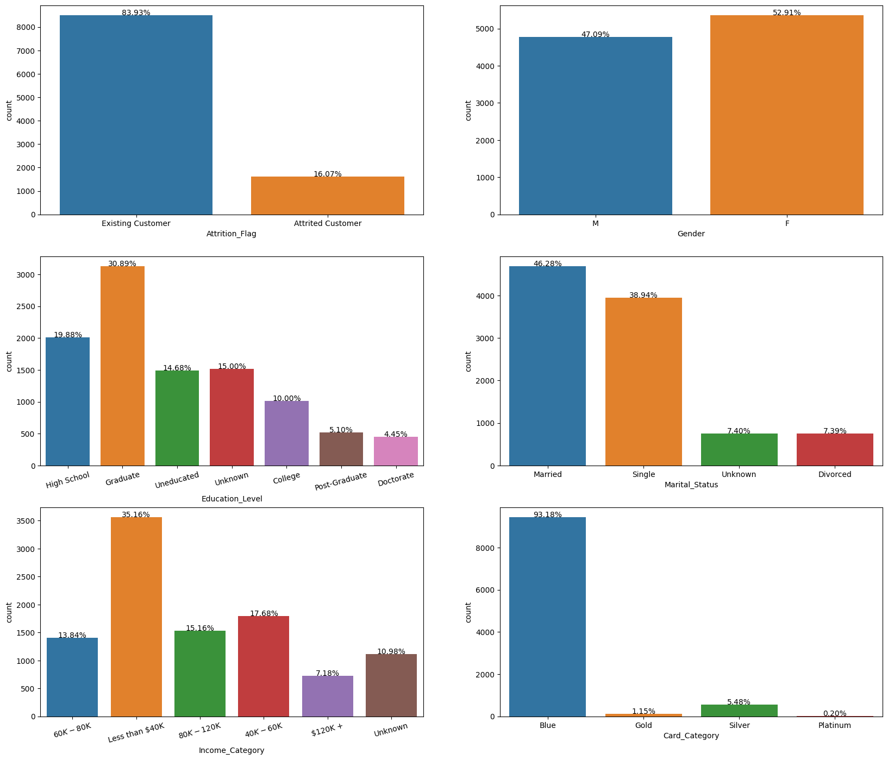
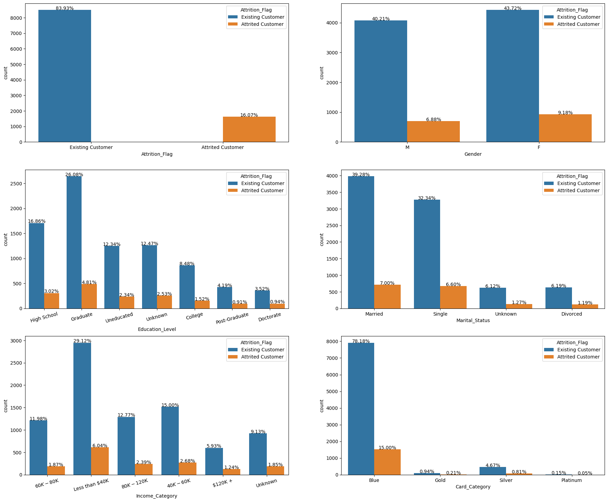
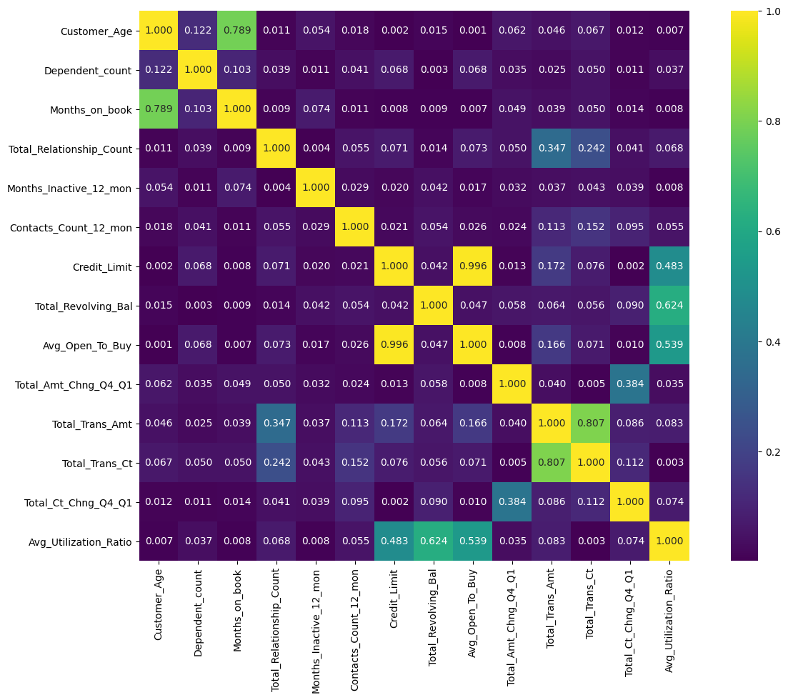

<!-- PROJECT LOGO -->
 

  <h2 align="center">Customer Credit Card Prediction</h2>

<!-- ABOUT THE PROJECT -->
## 1. Project Description
### 1.1 Problem Context
A bank manager is uncomfortable with more and more customers leaving their credit card services. They would really appreciate it if someone could predict who will be affected so that they can proactively go to the customer to provide them with better services and turn customer decisions in the opposite direction.

### 1.2 The goal
This project is carried out in a sequence of steps, the first of which consists of an exploratory analysis, where the objective is to know the behavior of the variables and to analyze attributes that indicate a strong relationship with the cancellation of credit card service customers. After the second part, which consists of applying resource engineering techniques, the third act consists of applying a machine learning algorithm to find the best resources for building the model. At the end of the project, after the completion of all steps, a machine learning model will be developed, capable of predicting, based on the data of a system, whether a customer will leave the credit card service or not.

### 1.3 Dataset
This data set consists of 10,000 customers mentioning their age, salary, status marital, credit card limit, credit card category, etc.

We have only 16,07% of customers who have canceled. Therefore, it is a little difficult to train our model to predict customer turnover.

## 2. Exploratory Data Analysis

### 2.1 Checking the frequency and unique features of all categorical variable in the data by plotting graph

### 2.2 Visualise the features frequency of customer who attrited between the categorical features

### 2.3 Now, let's see the features correlation between the numerical features

<!-- GETTING STARTED -->

## 3. Modelling & Hyperparameter Tuning

### 3.1 Imbalanced dataset
Since, we have an imbalanced dataset where Existing Customer:8500 and Attrited Customer:1627. We will handle it by applying KFold and over-sampling (SMOTE) method to the dataset. Our aim is to find a classifier with a good recall (i.e. we want our classifier to find as many attrited cases as it can).

### 3.2 K-Fold
The general procedure is as follows:
Shuffle the dataset randomly.
Split the dataset into k groups
For each unique group:
Take the group as a hold out or test data set
Take the remaining groups as a training data set
Fit a model on the training set and evaluate it on the test set
Retain the evaluation score and discard the model
Summarize the skill of the model using the sample of model evaluation scores

### 3.3 SMOTE
SMOTE can be used to create as many synthetic examples for the minority class as are required. It is used to oversample the minority class to increase it length to or close to the majority class

## 4 Algorithms

### 4.1 Random Forest Classifier
Random forest, like its name implies, consists of a large number of individual decision trees that operate as an ensemble. Each individual tree in the random forest spits out a class prediction and the class with the most votes becomes our model’s prediction

### 4.2 Logistic Regression
Logistic Regression is a statistical model used to determine if an independent variable has an effect on a binary dependent variable. This means that there are only two potential outcomes given an input.

### 4.3 Support Vector Machine (SVM)
Support Vector Machine or SVM is one of the most popular Supervised Learning algorithms, which is used for Classification as well as Regression problems. However, primarily, it is used for Classification problems in Machine Learning.

The goal of the SVM algorithm is to create the best line or decision boundary that can segregate n-dimensional space into classes so that we can easily put the new data point in the correct category in the future. This best decision boundary is called a hyperplane.

SVM chooses the extreme points/vectors that help in creating the hyperplane. These extreme cases are called as support vectors, and hence algorithm is termed as Support Vector Machine.

